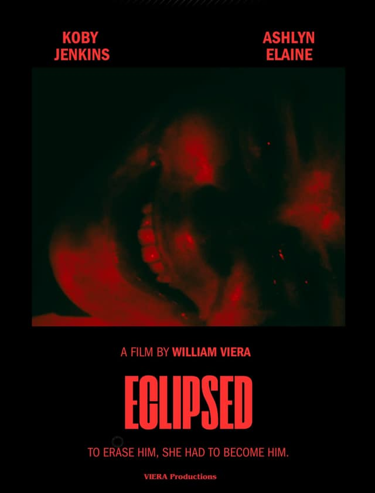
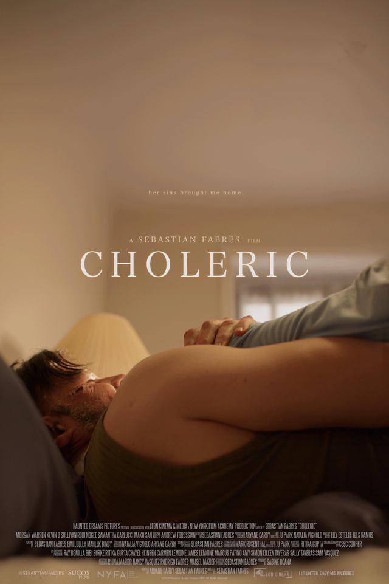

# horror.zazieproductions.com

**The horror-facing portfolio of Zazie Productions — the scoring and sound-design studio of composer Zazie Kanwar-Torge.**

An immersive web environment for psychological horror scoring, experimental composition, sound design, and dark audiovisual work — at the intersection of **horror cinema × experimental music × sound design × interactive web technology**.

[](https://horror.zazieproductions.com)
[](#architecture)
[](#deployment)
[](#core-experiences--features)
[](#seo--structured-data)

---

## Table of contents

1. [Live site](#live-site)
2. [What this repository is](#what-this-repository-is)
3. [Purpose & creative direction](#purpose--creative-direction)
4. [Core experiences & features](#core-experiences--features)
5. [Visual preview](#visual-preview)
6. [Audio & audiovisual systems](#audio--audiovisual-systems)
7. [Architecture](#architecture)
8. [Technology stack](#technology-stack)
9. [Repository map](#repository-map)
10. [Where to add new work](#where-to-add-new-work)
11. [Local development](#local-development)
12. [Configuration & environment](#configuration--environment)
13. [Media & asset pipeline](#media--asset-pipeline)
14. [Performance](#performance)
15. [Accessibility](#accessibility)
16. [SEO & structured data](#seo--structured-data)
17. [Deployment](#deployment)
18. [Known technical debt](#known-technical-debt)
19. [Development guardrails](#development-guardrails)
20. [AI-agent continuity](#ai-agent-continuity)
21. [Roadmap](#roadmap)
22. [Credits & authorship](#credits--authorship)
23. [License](#license)
24. [Related documents](#related-documents)

---

## Live site

**<https://horror.zazieproductions.com>**

Primary routes:

| Route | Role |
| --- | --- |
| `/` | The portfolio: a single continuous React experience (productions, showreel, film samples, press, approach, rates, composer, reviews, inquiry) |
| `/work` · `/reel` · `/composer` · `/process` · `/services` · `/contact` | Indexable hub pages mirroring the portfolio's content silos |
| `/store` | The Catalogue: records, sound libraries, tools and objects — 24 items, checkout delegated to Bandcamp, itch.io, Gumroad and eBay |
| `/legal` · `/faq` · `/terms` · `/privacy` · `/licensing` · `/purchases` · `/accessibility` | Trust, legal and operating documents |
| `/404.html` | "Signal Lost: Archive Entry Not Found" — a real 404 status with a recovery grid of all routes |

Every route is a **real static path** (`<slug>/index.html`). There is deliberately no SPA rewrite fallback — see [Deployment](#deployment) for the redirect-loop history that decision comes from.

## What this repository is

This repository is simultaneously:

- **Portfolio documentation** — what the site is, for directors, producers, supervisors and collaborators.
- **An architectural map** — where every system lives, so development resumes without re-discovery.
- **A contributor guide & development memory** — guardrails, recipes, and dated implementation records (`*.md` at root).
- **The deployment artifact itself.** The served site is checked in at the repository root. There is no CI build: what is on `main` is what the edge serves.

> **The single most important fact for anyone (or any agent) touching this repo:** the main portfolio's React/TypeScript **source tree is not in this repository**. `index-<hash>.js` is a built Vite bundle, and `index.html` is its prerendered counterpart. The bundle retains `data-source-loc="src/components/X.tsx:line:col"` attributes that document the original component paths, and this README reconstructs that map below — but there is no `package.json` and no build pipeline for the React app here. Changes to the home experience are made by **editing the committed bundle and the prerendered HTML in tandem** (the "dual-DOM rule", see [Architecture](#architecture)). Everything else — the documents, the catalogue, the sitemap — has full in-repo sources and build scripts.

## Purpose & creative direction

Zazie Productions scores psychological horror: dread, tension, possession, cosmic and body horror — for film, TV and games, alongside sound-design libraries and experimental records released under the same name.

The site is built to *demonstrate* rather than describe that identity:

- **A restrained dark system, not decoration.** One palette (`void #030303`, `ink`, `smoke`, `ash`, `mist #9a9590`, `bone #f0ebe3`, `blood #c41e1e`, `ember #ff2a2a`), one serif voice (Cormorant Garamond) against one workhorse sans (Inter variable), and a fixed atmosphere layer (film grain, vignette, drifting ambient orbs, ken-burns hero) that is part of the first painted frame, not an after-effect of JavaScript.
- **"The Archive" frame.** The 404 is an archive-entry error; the optional boot intro is a tape deck ("TAPE 00 · "SHOWREEL" · PROPERTY OF ZAZIE PRODUCTIONS"); the copy speaks in catalogue and signal language. The metaphor is consistent and quiet.
- **Listen first.** The showreel — 29 original cues, playable inline, organised by mood — is the centre of gravity of the whole site. Film samples embed the scores *in context*. Commerce points outward to marketplaces rather than building a parallel shop.
- **No backend, no tracking.** The inquiry form composes an email in the visitor's own mail client. No cookies, no analytics, no accounts, no newsletter. The privacy notice inventories every third party the site can touch, and a device inspector lets the visitor verify the claims themselves.

Unconventional choices exist for artistic or experiential reasons and are documented where they do. Do not flatten them into generic SaaS patterns.

## Core experiences & features

**The portfolio (`/`)** — prerendered HTML that is fully meaningful before JavaScript, then re-rendered live by React:

- **Selected productions** — 9 films/series with a poster wall (AVIF/JPG responsive images, click-through 1200 px lightbox): EXPIRE, UNSEEN, PEREGRINUS, Phantom Requiem, ECLIPSED, THE HAUNTED, CHOLERIC, MIKE HAS A VISITOR, THE DARK AWAITS.
- **Showreel** — 29 original cues (`/audio/track-00.mp3` … `track-28.mp3`, ≈95 MB total) with per-cue mood tags (Psychological, Tension, Body Horror, Cosmic Horror, Dark Ambient, …), mood-cluster browsing, and a **sticky global player** driven by a single shared `<audio>` element through a React context.
- **Film samples** — 7 embeds: 6 lazy `youtube-nocookie.com` players plus 1 Google Drive preview, with poster-`<picture>` covers.
- **Press kit** — features and coverage (Visual Container award-winners press release PDF, Grammy Weekly, Limitless Magazine, Billboard Wire).
- **Approach / Rates / Composer / Reviews / Inquiry** — scoring method, scope-and-estimate bands (student films from $75.99; sliding scale by project funding, typically a few hundred dollars, as published on `/services`), biography, 5.0 collaborator rating with 4 featured reviews, and a structured inquiry form that builds a `mailto:` handoff.

**The ZP Archive Boot** — a minimal terminal loading screen, inline in `index.html` (zero network requests): quiet monochrome archive text, subtle scanlines/noise, and a short typed handoff into the site. It runs once per session on production, can be replayed with `?boot=1` or `#boot`, disabled with `?boot=0` or `#noboot`, is skipped for bots and `prefers-reduced-motion` users unless forced, contains no audio, is skippable by any input, and hard-caps itself at ~7 s.

**The Catalogue (`/store`)** — 24 items across Records / Objects / Sound libraries / Tools and scores. Progressive enhancement only: without JavaScript every card is visible and links straight to its listing; with JavaScript you get filter chips, audio previews with a **room-tone ambience** that ducks under them, a torch-light cursor, and card tilt.

**The documents** — `/legal`, `/faq` (36 questions), `/terms` (25 clauses), `/privacy` (15 sections), `/licensing`, `/purchases`, `/accessibility`. Share one stylesheet, one script and two partials; ship fully open without JavaScript; served **network-first** through the service worker because their effective dates matter.

## Visual preview

Film key art from the poster wall (grid assets shown; the lightbox serves 1200 px variants):

| | | | |
| --- | --- | --- | --- |
|  |  |  |  |

All artwork © the respective productions. See the [live site](https://horror.zazieproductions.com) for the full experience — the atmosphere layer, showreel and boot sequence are the point, and none of them fit in a static image.

## Audio & audiovisual systems

| System | Where it lives | Notes |
| --- | --- | --- |
| Showreel audio engine | `src/lib/audioContext.tsx` (in bundle), rendered by `Showreel.tsx` + `StickyPlayer.tsx` | One `<audio>` element for the whole site, shared through React context: `playTrack / toggle / next / prev / seek / setVolume`. Previous-track restarts if >3 s in. `preload="metadata"`; MP3s stream from `/audio/`, cached `immutable` at the edge. |
| Mood clusters | `tracks` array in the bundle (29 entries: `id, title, src, duration, tag`) | Each cue carries one mood tag; `/reel` mirrors the list with `AudioObject`/`MusicRecording` schema. |
| Sticky player | `StickyPlayer.tsx` | Hidden until first play; animated wave-bar visualisation; respects `prefers-reduced-motion`. |
| Film samples | `Projects.tsx` data + prerendered covers | 6 YouTube-nocookie iframes get a real `src` only when lazy-loaded; 1 Google Drive embed; `preconnect` to YouTube deferred off the critical path. |
| Boot terminal | inline in `index.html` | Minimal typed loading screen, zero network requests, silent, once per session with replay/disable query hooks. |
| Store previews & room tone | `store-src/store.js` | Per-card audio previews (`data-preview`); a looping room tone (`data-ambience`) crossfades down while previews play. `preload="none"`. |
| External score player | Reelcrafter | Allowlisted in CSP (`frame-src`) and referenced as a `significantLink` in JSON-LD; currently linked, not embedded. |

## Architecture

Three build systems of different eras, plus a set of committed hub pages, all served as one static tree:

```
┌──────────────────────────────────────────────────────────────────────┐
│ SOURCE-IN-REPO?         SYSTEM                        OUTPUT          │
├──────────────────────────────────────────────────────────────────────┤
│ ✗ (built elsewhere)     React + Vite + Tailwind       index.html      │
│                         (bundle keeps data-source-loc)  index-<hash>.js│
│                                                         index-<hash>.css
│ ✓ store-src/ + build.sh hand-rolled page, no framework store-<hash>.* │
│                                                       store/index.html
│ ✓ legal-src/ + build.sh bash+python3 generator          <slug>/index.html
│                          (7 documents; generates        legal-<hash>.* │
│                           FAQPage schema from markup)                  │
│ ✗ committed output      hub pages (/work /reel /composer               │
│                         /process /services /contact)   <slug>/index.html
│                         share legal-<hash>.css/.js      (no source here)│
└──────────────────────────────────────────────────────────────────────┘
```

### The dual-DOM rule

The home experience exists **twice**, and both copies must match:

1. the **prerendered static DOM** inside `index.html` — what crawlers and pre-JS visitors see, including the full atmosphere layer, and
2. the **React render** from the bundle, which mounts into `#root` and rebuilds that DOM on boot.

A change made in only one copy flashes, disappears, or diverges. Every user-visible edit to `/` must be applied to both, byte-consistently. (The service-worker comment records the contract: "prerendered #root now matches the React render exactly".)

### Component map of the bundle

Reconstructed from `data-source-loc` breadcrumbs preserved in `index-<hash>.js` — the original `src/` tree looked like this:

```
src/
├── main.tsx                  # entry; dynamic-import boot, SW registration
├── App.tsx                   # section composition
├── lib/audioContext.tsx      # global single-audio player state
└── components/
    ├── Nav.tsx               # header tabs + sub-xl mobile menu
    ├── Hero.tsx              # atmosphere stack, ken-burns portrait
    ├── PosterWall.tsx        # 9 productions, lightbox
    ├── Projects.tsx          # film data (n1 array) + film samples
    ├── Showreel.tsx          # 29 cues, mood browsing
    ├── StickyPlayer.tsx      # persistent now-playing bar
    ├── PressKit.tsx          # press features + PDF
    ├── Method.tsx            # scoring approach
    ├── Services.tsx          # scope & estimate bands
    ├── About.tsx             # composer bio
    ├── Testimonials.tsx      # reviews (with StarRating.tsx)
    ├── Contact.tsx           # mailto inquiry builder
    ├── Footer.tsx            # legal row + entity footer
    └── AmbientLight.tsx      # drifting ambient orbs
```

### Rendering & delivery model

- **First paint is the world.** Fonts (3 self-hosted woff2, metric-override fallbacks), hero images (`fetchpriority="high"`), grain, vignette and orbs are all in the static HTML. The 426 KB React bundle dynamic-imports after `load` + idle, off the critical path.
- **Service worker (`sw.js`, v9)** — precaches ~60 URLs (all routes, hashed assets, fonts, images); **stale-while-revalidate** for navigations (0 ms repeat visits), **network-first** for legal/document routes, **cache-first** for statics. `CACHE_NAME` must be bumped whenever any precached hash changes.
- **Edge layer** — `_headers` carries the CSP allowlist (youtube-nocookie, drive.google.com, reelcrafter, four marketplace image CDNs — nothing else), canonical `Link:` headers for 45 URL variants, differentiated `Cache-Control` (hashed assets `immutable` 1 y; HTML `must-revalidate`). `_redirects` is **301-only**: legacy `.html` → pretty URLs. No `/* /index.html 200` splat.

## Technology stack

As shipped (verified from the artifacts):

- **React 18** (`createRoot`) + **Vite**-built single bundle — source tree not in repo
- **Tailwind CSS** (custom tokens above) compiled to `index-<hash>.css`
- **Vanilla ES modules** for the documents (`legal-src/legal.js`) and catalogue (`store-src/store.js`) — progressive enhancement, no framework
- **Service Worker API** — hand-written `sw.js`
- **Cloudflare Pages** — static hosting, `_headers` / `_redirects` semantics
- **Bash + Python 3** — the two build scripts
- **Node.js** (no dependencies, `node:http` only) — dev server and sitemap validator

No analytics, no tracking, no cookies, no fonts CDN, no external JS.

## Repository map

```
.
├── index.html                  # Home: prerendered DOM + inline boot system + 15 JSON-LD blocks
├── index-<hash>.js / .css      # React bundle (built; rename per raw-sha256[:8] convention)
├── 404.html                    # "Signal Lost" — served with real 404 status
├── sw.js                       # Service worker v9 (bump CACHE_NAME on any hash change)
├── server.mjs                  # Local static server, clean routes + 404 fallback
├── _headers                    # CSP, canonical Link headers, cache policy
├── _redirects                  # 301 map ONLY (no SPA rewrite — see Deployment)
├── robots.txt / sitemap.xml    # Crawl control; 15 URLs / 44 images / 8 videos
├── audio/
│   └── track-00..28.mp3        # 29 showreel cues (~95 MB) — the audio library
├── fonts/                      # Cormorant Garamond 400 n/i + Inter variable (woff2)
├── images/
│   ├── posters/<slug>-{640.avif,640.jpg,1200.jpg}   # 9 productions × 3 variants
│   ├── hero-portrait.{avif,jpg}, headshot.{avif,jpg}, press-photo.jpg
│   ├── atmosphere-bg.jpg       # hero ken-burns layer
│   └── project-*.jpg           # film-sample covers (YouTube IDs / -drive)
├── work/ reel/ composer/ process/ services/ contact/
│   └── index.html              # Hub pages — COMMITTED OUTPUT, no in-repo source
├── store.html → store/index.html   # Catalogue — GENERATED, do not hand-edit
├── store-src/                  # Catalogue source (store.html/.css/.js + build.sh)
├── legal/ faq/ terms/ privacy/ licensing/ purchases/ accessibility/
│   └── index.html              # Documents — GENERATED, do not hand-edit
├── legal-src/                  # Document sources, shared partials, CSS/JS, build.sh
├── tools/check-sitemap.mjs     # Sitemap pre-flight validator (15 GSC checks)
├── The Dark Awaits.png         # Raw poster upload kept for provenance (unreferenced)
├── PERFORMANCE.md LEGAL.md RATIFY.md SEO-DOSSIER.md SITEMAP.md STORE.md
│                               # Dated implementation records — the repo's memory
└── .nojekyll
```

### Where each kind of system lives

| Concern | Location |
| --- | --- |
| Pages / routes | `<slug>/index.html` at root; home in `index.html` |
| Portfolio entries & film data | `n1` array in `index-<hash>.js` (original: `Projects.tsx`); prerendered grid in `index.html` |
| Scoring work / showreel data | `tracks` array in `index-<hash>.js` (original: `Showreel.tsx` + `src/lib/audioContext.tsx`) |
| Audio | `/audio/track-NN.mp3` |
| Video | Embeds only (YouTube-nocookie ×6, Google Drive ×1); no video files in repo |
| Images | `/images` (+ `/images/posters` for the wall) |
| Interactive components | React bundle (portfolio); `store-src/store.js` (catalogue); inline boot in `index.html` |
| Animation systems | CSS in `index-<hash>.css` + inline `<style>` blocks (boot); all `prefers-reduced-motion`-aware |
| Styling / design tokens | Tailwind theme in `index-<hash>.css` (`--color-void` … `--color-ember`); `legal-src/legal.css` and `store-src/store.css` restate the same tokens |
| Metadata / SEO | Inline JSON-LD matrix in each page; `sitemap.xml`; `robots.txt`; canonical `Link:` headers in `_headers` |
| Configuration | `_headers`, `_redirects`, `sw.js` — no environment variables |
| Utilities | `tools/check-sitemap.mjs`, `server.mjs` |
| Public/static assets | root + `/audio` + `/fonts` + `/images` |
| Data / content files | `store-src/store.html` (catalogue data), `legal-src/pages/*.html` (document content), bundle arrays (films, tracks, reviews) |

## Where to add new work

Recipes for the six most likely changes. In every case: **grep the counts** — production (9), cue (29) and item (24) totals appear in meta descriptions, FAQ answers, schema `numberOfItems`, hero copy and footers, and must move together.

**New film / production** (touches both DOM copies):
1. Poster assets → `images/posters/<slug>-640.avif`, `-640.jpg`, `-1200.jpg` (see [pipeline](#media--asset-pipeline)).
2. Entry in the `n1` array of the bundle (`title`, `year`, `tagline`, `detail`, `poster/thumb/thumbA`, optional `imdb` / `yt`).
3. Matching `<li>` in the prerendered poster grid in `index.html` + `pageImages` / lightbox lists in the inline module script.
4. `/work/index.html` ItemList entry (committed output — edit the page directly until its source moves in-repo).
5. `sitemap.xml` image entry → run `node tools/check-sitemap.mjs`.
6. `sw.js` precache list → **bump `CACHE_NAME`**.
7. Counts in meta/OG/Twitter descriptions, FAQ answer, hero lede, footer — everywhere "9 productions" appears.

**New score / showreel cue:**
1. Master to MP3 → `audio/track-NN.mp3` (next free index; filenames are positional, don't renumber).
2. Entry in the bundle `tracks` array (`id`, `title`, `src`, `duration` in seconds, `tag`).
3. `/reel/index.html` cue list + `AudioObject`/`MusicRecording` schema.
4. `sitemap.xml` playlist entries → validator.
5. Counts: "29 cues" lives in meta descriptions, `/reel` H1, hero copy.

**New audio demo (non-showreel):** add under `/audio/` with a descriptive name, reference it from the page that presents it, and add any page-level schema it needs. Keep `preload="none"` or `"metadata"` — never `auto`.

**New visual project / film sample:** cover image → `images/project-<id>.jpg` pattern; entry beside the film-sample data in the bundle **and** the prerendered covers in `index.html`; schema `VideoObject` + sitemap `video:video` if it is a real embed.

**New portfolio category / hub page:**
1. Create `<slug>/index.html` as a **real static path** — never a rewrite target (see [Deployment](#deployment)).
2. Reuse `legal-<hash>.css` / `legal-<hash>.js` and the shared partials so the page inherits the document chrome; follow the structure of `/work`.
3. Add canonical entries to `_headers`, precache + navigation policy in `sw.js` (bump `CACHE_NAME`), nav/footer links in **all three footers** (prerendered, bundle, legal partial), `sitemap.xml` → validator.

**New interactive experiment:** build it as a self-contained progressive-enhancement module first (the `store-src` pattern: fully usable without JS, behaviour layered on), not as a new framework. Only promote into the main bundle when it earns a permanent place.

## Local development

No `package.json`, no install step. Requirements: Node.js (built-in modules only), Bash + Python 3 (for the two build scripts).

```bash
# Serve the built site locally (clean routes, correct 404 fallback)
node server.mjs                 # → http://localhost:8080  (PORT env overrides)

# Rebuild the catalogue after editing store-src/*
./store-src/build.sh            # writes store-<hash>.* , store.html , store/index.html

# Rebuild the documents after editing legal-src/*
./legal-src/build.sh            # writes legal-<hash>.* and all seven <slug>/index.html

# Validate the sitemap (structure, files, canonicals, robots)
node tools/check-sitemap.mjs          # offline
node tools/check-sitemap.mjs --live   # + HTTP status of every URL
```

**Never hand-edit generated files:** `store.html`, `store/index.html`, `legal/*/index.html`, `faq/`, `terms/`, `privacy/`, `licensing/`, `purchases/`, `accessibility/`, and any `*-<hash>.js/.css`. Edit the sources, run the build. The React bundle has no in-repo build — see [Known technical debt](#known-technical-debt).

## Configuration & environment

There are **no environment variables and no secrets**. The `.gitignore` pre-emptively excludes `.env*` and `.wrangler/`. All configuration is declarative and versioned:

| File | Controls |
| --- | --- |
| `_headers` | CSP allowlist, `X-Robots-Tag`, canonical `Link:` headers, per-path `Cache-Control` |
| `_redirects` | Legacy 301 map (deliberately nothing else) |
| `robots.txt` | Crawl rules, sitemap declaration, AI-crawler policy |
| `sw.js` | Offline strategy; `CACHE_NAME` + precache manifest |
| `server.mjs` | `PORT` (local dev only) |

The zero-tracking privacy claim is structural: adding an analytics script or a cookie would invalidate `/privacy`, the footer statement on every page, and the device inspector on `/privacy`. Don't.

## Media & asset pipeline

### Images — the poster pipeline

Each production ships exactly three derivatives, verified at display size:

| File | Role | Served |
| --- | --- | --- |
| `images/posters/<slug>-640.avif` | grid, AVIF-capable browsers (10–83 KB, q60) | `<picture>` first source |
| `images/posters/<slug>-640.jpg` | grid fallback, progressive JPEG (q82) | `<picture>` fallback |
| `images/posters/<slug>-1200.jpg` | lightbox only, on click (q82) | never loaded in the grid |

Rules: always set `width`/`height` (CLS-safe); grid and client render must reference identical URLs (the React render swaps in and must not re-download); hero and portraits use the same `<picture>` AVIF→JPG pattern with `fetchpriority="high"` preloads. Raw uploads are **not** committed as site assets — they are cleaned, cropped to key art, and encoded per this table. (The one exception, `The Dark Awaits.png` at root, is kept only as provenance and referenced by nothing.)

### Audio

`/audio/track-NN.mp3`, positional numbering, ~95 MB for 29 cues. Streamed with `preload="metadata"`; edge-cached `immutable` 1 y. Audio quality decisions belong to the composer — don't transcode the library without asking. This is the repo's largest payload and grows linearly with the catalogue; see [Known technical debt](#known-technical-debt).

### Video & external embeds

No video files in the repo. Film samples are lazy `youtube-nocookie.com` iframes (real `src` assigned post-load so `loading="lazy"` holds) and one Google Drive preview. YouTube thumbnails come from `i.ytimg.com`; catalogue covers from four marketplace CDNs — all enumerated in the CSP. External embeds are a known fragility: the Drive preview depends on Google's scanner behaviour (recorded in `PERFORMANCE.md`).

### Adding media safely — checklist

- [ ] Correct derivative set and naming (`<slug>-640.avif|-640.jpg|-1200.jpg` or `project-<id>.jpg`)
- [ ] `width`/`height` on every ``/`<picture>`; `loading="lazy"` below the fold
- [ ] Referenced from **both** DOM copies (prerendered + bundle) with identical URLs
- [ ] Added to `pageImages` (inline module script), lightbox list if applicable, `sw.js` precache (+ `CACHE_NAME` bump), `sitemap.xml` (+ validator pass)
- [ ] Domain of any new external host added to the CSP in `_headers` — the strictest allowlist wins, so a missing domain is a broken resource, not a warning
- [ ] `prefers-reduced-motion` behaviour considered for anything that moves

## Performance

Recorded results of the performance mandate (`PERFORMANCE.md` — numbers below are from that audit and current byte counts):

- **Critical transfer** ≈ 260 KB desktop (HTML 224 KB raw / 39 KB gzip, CSS 75 KB / 13 KB, fonts ~100 KB, hero AVIF 143 KB) with the 426 KB / ~123 KB-gzip bundle deliberately **off the critical path** (dynamic import at `load` + idle).
- **Poster wall scroll cost** cut from 9.15 MB of originals to ≤ 323 KB initial (AVIF-capable) / ≤ 593 KB (JPEG-only), via the 640/1200 derivative pipeline.
- **Fonts**: 3 self-hosted woff2 with `ascent/descent-override` metric fallbacks — near-zero swap shift, no third-party origin.
- **Repeat visits**: service-worker stale-while-revalidate gives ~0 ms navigations.
- **Guard the budget**: heavy media is the growth axis of this site. New media must enter through the pipeline above; anything that pushes first-paint cost back up (eager JS, unoptimized posters, render-blocking requests) is a regression.

Not yet measured in a real browser: field LCP/CLS/CrUX data. The audit was verified by static analysis and a jsdom smoke test in its sandbox, and says so honestly.

## Accessibility

Target: **WCAG 2.2 Level AA, partially conformant** — stated precisely on [`/accessibility`](https://horror.zazieproductions.com/accessibility), which implements the pattern this repo expects: *implemented features and measured gaps are named, not hand-waved*.

- Progressive enhancement everywhere: every document clause, FAQ answer, catalogue card and link works with JavaScript off.
- `prefers-reduced-motion` stops the ken-burns hero, ambient orbs and wave animation; the boot sequence never auto-plays sound and is reduced-motion-gated.
- Semantic headings, single H1 per page, skip links, `aria-pressed`/`aria-label` on controls, breadcrumbs in schema and (on document pages) visibly.
- Document pages keep a legibility red (`--blood-text #e65650`, 5.71:1 on void) where small text needs it.
- **Named gaps** (see `/accessibility` §4): the portfolio and catalogue still use darker red `#c41e1e` (3.49:1) for small labels, and atmosphere effects create exceptions on the portfolio pages. These are recorded deliberately — fix them in the open, don't quietly restyle the identity either way.

## SEO & structured data

The site runs a deliberately deep SEO layer (the repo's `SEO-DOSSIER.md` and `SITEMAP.md` record the full programme):

- A **JSON-LD matrix** per page: `Person`/`Organization` entity graph, `Service`/`Offer` catalogue, `VideoObject` ×8, `FAQPage`, `Review`/`AggregateRating`, `CollectionPage`+`ItemList` per hub, `MusicPlaylist`+29 `MusicRecording`/`AudioObject` on `/reel`, `HowTo` on `/process`.
- `sitemap.xml` (15 URLs / 44 images / 8 videos) enforced by `tools/check-sitemap.mjs` — a pre-flight validator that replicates 15 Google Search Console checks (canonical equality, schema element order, robots interplay, on-disk asset existence) and fails loudly. **Run it before every deploy that touches routes or media.**
- Canonical `Link:` headers at the edge for 45 variants; 301s for legacy `.html` URLs; a real 404 (no soft-404 SPA fallback); robots policy including explicit AI-crawler allowances.

## Deployment

**Cloudflare Pages**, serving the repository root as a static asset tree — merge to `main` and the edge updates. No build command, no output directory: the committed tree *is* the deploy.

Two hard-won rules recorded in `STORE.md` / `LEGAL.md` / `SEO-DOSSIER.md`:

1. **Never rewrite routes to `.html` targets.** Cloudflare Pages redirects `.html` URLs to their pretty form, so a `200` rewrite (`/store → /store.html`) loops forever (`ERR_TOO_MANY_REDIRECTS`). Every route must exist as `<slug>/index.html`. The `/* /index.html 200` SPA splat was also removed — it turned every 404 into a soft 404.
2. **Hashed assets are immutable — the hash is the cache-buster.** Content-hash filenames (`index-<hash>.js`, `store-<hash>.css`, `legal-<hash>.js`) carry `Cache-Control: immutable, max-age=1y`. Change content → change the name (the build scripts do this; for the React bundle, rename per the raw `sha256[:8]` convention) → update the referencing HTML *and* the `sw.js` precache list → bump `CACHE_NAME`.

## Known technical debt

Documented honestly, in priority order — these are real, verified in the tree:

1. **The React source tree is not in this repository.** The home experience can only be changed by patching the built bundle and the prerendered HTML in tandem. The bundle's `data-source-loc` attributes preserve the original component map (documented above) so edits can find their targets, but this is surgery on artifacts. The recorded end-state (`PERFORMANCE.md`): regenerate the static HTML from the app and switch `createRoot` → `hydrateRoot`, with source under version control.
2. **Hub pages have no in-repo source.** `/work`, `/reel`, `/composer`, `/process`, `/services`, `/contact` are committed output sharing the legal CSS/JS, produced during the SEO pass but not generated by `legal-src/build.sh`. They are edited directly; treat them as generated files without a generator.
3. **`sw.js` precache drift.** The manifest lists `store-ec9af1c2.css`; the shipped file is `store-8af6034d.css`. Install survives (all-settled) and runtime cache-first still fetches the real file, but the stale entry should be corrected and the file's hash-sync rule reinforced.
4. **95 MB of MP3 in Git.** The audio library lives in the repo and grows with every cue. Fine at this scale; will eventually need Git LFS or external storage.
5. **Two hash conventions.** `legal-src`/`store-src` hash `"$(cat file)"` (trailing newline stripped); the React bundle hash is `sha256` over raw bytes. Both are content-hashes; know which one you're reproducing.
6. **Duplicate footers by construction.** Three footers exist (prerendered, bundle, legal partial) because three systems render chrome. They must be kept in sync manually — a known, accepted cost of the current architecture, not an invitation to add a fourth.

## Development guardrails

- **Preserve the identity.** The archive/tape language, the grain-and-blood palette, the typographic pairing and the atmosphere layer are the product. Do not homogenize them into generic SaaS aesthetics.
- **Atmosphere never breaks function.** Every experimental interaction (boot, torch, sticky player, tilt) must remain skippable, reduced-motion-aware, and harmless when JavaScript fails entirely.
- **Real paths, real statuses.** New routes are `<slug>/index.html`. No rewrites to `.html`, no soft 404s.
- **The dual-DOM rule is absolute.** A change to `/` that lands in only one copy is a bug.
- **Reuse before new.** Design tokens, the shared partials, the legal/store build pattern, and existing components come first. No new frameworks, no new CSS systems, no parallel implementations of an existing one. Duplicated components (see debt #6) are a cost, not a pattern.
- **Avoid dependencies.** Zero-runtime-dependency is a feature and a privacy claim. Any new third-party origin must be added to the CSP, inventoried in `/privacy`, and justified.
- **Counts move together.** Production/cue/item totals appear in metadata, schema, FAQ and copy — update them everywhere or not at all.
- **Protect loading performance** as the media library grows; all media enters through the pipeline.
- **Keep production and experiments separate.** Experiments live behind explicit mechanisms (`?boot=1`) or as progressive enhancement until proven.
- **Documents sit still.** Legal/operating pages carry no torch, no scanlines, no roll — people rely on them.
- **Update the records.** This repo keeps dated implementation records (`*.md`). If architecture changes, the records and this README change with it.

## AI-agent continuity

For future AI-assisted development sessions. **Before changing anything:**

1. **Inspect the architecture first** — read this README, then the relevant record (`PERFORMANCE.md`, `LEGAL.md`, `RATIFY.md`, `STORE.md`, `SITEMAP.md`, `SEO-DOSSIER.md`), then the actual files.
2. **Identify the canonical implementation** before writing any component. If a system exists (player, lightbox, poster pipeline, document chrome), extend it — do not create a sibling.
3. **Check whether your target is generated.** If so, edit the source and run the build; never the output.
4. **Apply the dual-DOM rule** for anything user-visible on `/` (prerendered `index.html` *and* bundle).
5. **Check mobile behaviour** — the portfolio has a sub-`xl` mobile menu and snap-scroll review rail; the store is touch-first.
6. **Check media and performance implications** — run the [media checklist](#adding-media-safely--checklist); keep the bundle off the critical path.
7. **Verify**: `node tools/check-sitemap.mjs` after route/media/schema changes; serve with `node server.mjs` and crawl; test the no-JS experience of whatever you touched.
8. **Update documentation** when architecture changes — this README and the dated records are the memory.

**Explicitly do not:**

- Create duplicate components, alternate implementations, or an abandoned rewrite of an existing system.
- Introduce unnecessary frameworks, UI libraries, analytics, or third-party scripts (the zero-tracking claim is load-bearing).
- Invent placeholder portfolio material — **no fictional films, fake credits, invented reviews, or dummy scores.** Real productions, real cues, real catalogue items only; if a link or credit is unknown (e.g. THE DARK AWAITS title links), ship without it and record that, exactly as the existing entries do.
- Make undocumented architectural changes, hand-edit generated files, reintroduce SPA rewrites, or ship a changed hash without bumping `CACHE_NAME` and updating every reference.
- Describe aspirational features as existing — in docs, schema, or copy.

## Roadmap

**Implemented** (all verifiable in this tree):

- Full portfolio experience: poster wall + lightbox (9 productions), 29-cue showreel with mood clusters and sticky player, 7 film samples, press kit, scope-and-estimate, reviews, `mailto:` inquiry
- Minimal once-per-session terminal boot sequence (`?boot=1` / `#boot` replay, `?boot=0` / `#noboot` disable), fully gated and failsafed
- Six indexable hub pages, seven legal/operating documents with generated FAQ schema, 20-item catalogue with progressive enhancement
- Service worker (SWR / network-first / cache-first tiers), CSP + canonical headers, 301 map, real 404
- Sitemap with image/video extensions plus a 15-check validator; JSON-LD matrix; AI-crawler policy
- Performance mandate executed (deferred bundle, AVIF pipeline, self-hosted fonts, prerendered first paint)

**Open items recorded in the repo** (in development / awaiting a decision):

- Human decisions collected in `RATIFY.md` (contracting entity confirmation, governing law, rights language — facts that create obligations, deliberately not invented)
- Eclipsed Google Drive sample: if it stops streaming, the fix is a re-upload on the Drive side (`PERFORMANCE.md`)
- THE DARK AWAITS: no title IMDb/video link known yet; falls back to the composer's IMDb
- Correct the stale `sw.js` store-CSS precache hash (debt #3); reconcile hub-page sources (debt #2)

**Potential / experimental** (recorded direction, not built):

- Bring the React/Vite source tree into this repository and regenerate the prerendered HTML from the app (`createRoot` → `hydrateRoot`), closing debts #1, #2 and the three-footer sync cost
- External storage or LFS for the audio library as it grows (debt #4)
- Reelcrafter score player: allowlisted and linked; a deeper embed is possible within the existing CSP

Nothing on this list should be described as shipped until it is in the tree.

## Credits & authorship

- **Composer & studio:** Zazie Kanwar-Torge — Zazie Productions LLC. All scores, cues, sound-design libraries and catalogue items are original work.
- **Productions scored** (as credited on the site): EXPIRE (dir. Muhammad Abed Baryal — sound design), UNSEEN (Steve Merlo), PEREGRINUS, Phantom Requiem, ECLIPSED (dir. William Viera · VIERA Productions), THE HAUNTED (dir. Mike Fox · Crystal Fox Films), CHOLERIC (dir. Sebastian Fabres · Haunted Dreams Pictures · NYFA), MIKE HAS A VISITOR (dir. Marco Saikaley), THE DARK AWAITS (dir. Matthew Kondracki). Artwork © the respective productions.
- **Press:** Visual Container, Grammy Weekly, Limitless Magazine, Billboard Wire (linked from the press-kit section).
- **Presence:** [IMDb](https://www.imdb.com/name/nm17333332) · [Bandcamp](https://zazieproductions.bandcamp.com) · [Spotify](https://open.spotify.com/artist/4UOgvZEOo7xBhFBjJvlMm0) · [YouTube](https://youtube.com/@zazieproductions) · [Apple Music](https://music.apple.com/us/artist/zazie-productions/1623719351)
- **Inquiries:** via [/contact](https://horror.zazieproductions.com/contact) (composing email in your own mail client — there is no form backend).

## License

**All rights reserved.** No open-source license is granted for the code, design, copy, artwork or audio in this repository.

- Music and catalogue licensing runs through [`/licensing`](https://horror.zazieproductions.com/licensing) and the marketplace listings on [`/store`](https://horror.zazieproductions.com/store).
- Site terms: [`/terms`](https://horror.zazieproductions.com/terms) · Privacy: [`/privacy`](https://horror.zazieproductions.com/privacy).
- Film key art remains the property of the respective productions.

## Related documents

The root `*.md` files are dated implementation records — the repo's development memory. Read the one matching your task before touching that system:

| Record | Covers |
| --- | --- |
| `PERFORMANCE.md` | Critical-path work, media pipeline, caching, verification, residual risks |
| `LEGAL.md` | The trust/legal layer: how the documents were built and deploy |
| `RATIFY.md` | Open facts a human must confirm (entity, law, rights) |
| `SEO-DOSSIER.md` | The technical SEO programme: IA silos, schema matrix, crawl policy |
| `SITEMAP.md` | Sitemap fixes and the validator contract |
| `STORE.md` | Catalogue build, data model, deployment lessons (the redirect loop) |
