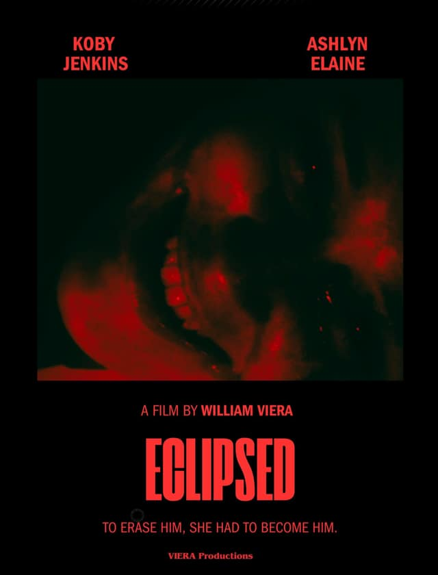
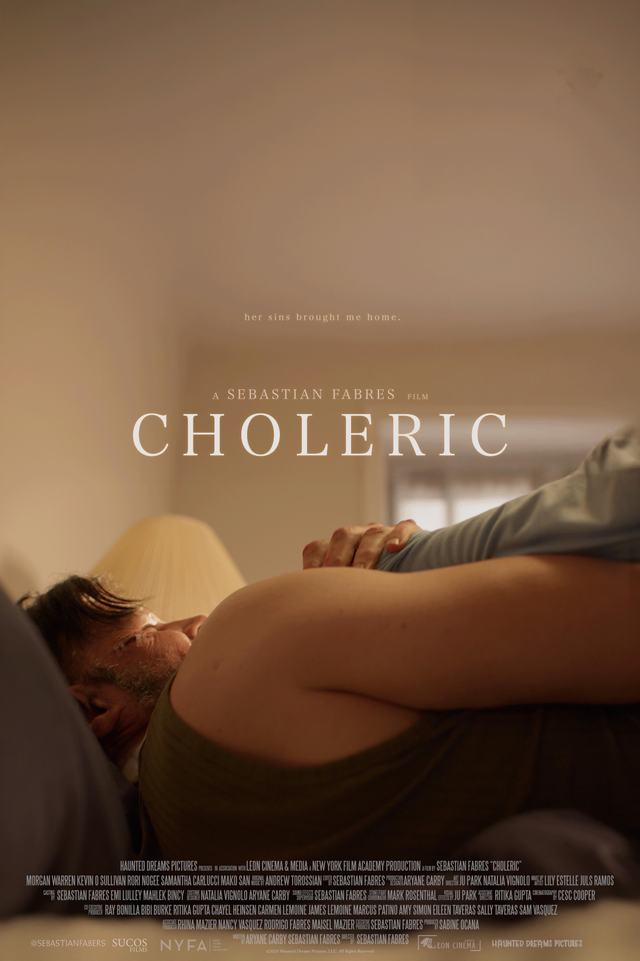

# horror.zazieproductions.com

**The horror-facing portfolio of Zazie Productions — the scoring and sound-design studio of composer Zazie Kanwar-Torge.**

An immersive web environment for psychological horror scoring, experimental composition, sound design, and dark audiovisual work — at the intersection of **horror cinema × experimental music × sound design × interactive web technology**.

[](https://horror.zazieproductions.com)
[](#architecture)
[](#deployment)
[](#core-experiences--features)
[](#seo--structured-data)

---

## Table of contents

1. [Live site](#live-site)
2. [What this repository is](#what-this-repository-is)
3. [Purpose & creative direction](#purpose--creative-direction)
4. [Core experiences & features](#core-experiences--features)
5. [Visual preview](#visual-preview)
6. [Audio & audiovisual systems](#audio--audiovisual-systems)
7. [Architecture](#architecture)
8. [Technology stack](#technology-stack)
9. [Repository map](#repository-map)
10. [Where to add new work](#where-to-add-new-work)
11. [Local development](#local-development)
12. [Configuration & environment](#configuration--environment)
13. [Media & asset pipeline](#media--asset-pipeline)
14. [Performance](#performance)
15. [Accessibility](#accessibility)
16. [SEO & structured data](#seo--structured-data)
17. [Deployment](#deployment)
18. [Known technical debt](#known-technical-debt)
19. [Development guardrails](#development-guardrails)
20. [AI-agent continuity](#ai-agent-continuity)
21. [Roadmap](#roadmap)
22. [Credits & authorship](#credits--authorship)
23. [License](#license)
24. [Related documents](#related-documents)

---

## Live site

**<https://horror.zazieproductions.com>**

Primary routes:

| Route | Role |
| --- | --- |
| `/` | The portfolio: a single continuous React experience (productions, showreel, film samples, press, approach, rates, composer, reviews, inquiry) |
| `/work` · `/reel` · `/composer` · `/process` · `/services` · `/contact` | Indexable hub pages mirroring the portfolio's content silos |
| `/hire-a-composer` · `/sound-design` · `/game-scoring` | Commission pages: the commercial pillar and its first two format spokes |
| `/store` | The Catalogue: records, sound libraries, tools and objects — 24 items, checkout delegated to Bandcamp, itch.io, Gumroad and eBay |
| `/legal` · `/faq` · `/terms` · `/privacy` · `/licensing` · `/purchases` · `/accessibility` | Trust, legal and operating documents |
| `/sitemap` | HTML site map: original hub pages and their in-page sections, linked from every footer (item URLs are listed in `/sitemap.xml`) |
| `404.html` (fallback document) | "Signal Lost: Archive Entry Not Found" — served with HTTP 404 and `noindex` for unknown paths |

Every route is a **real static path**: original hubs use `<hub>/index.html` plus a byte-identical root twin, while generated item URLs use flat `<hub>/<slug>.html` files with no slash twin. There is deliberately no SPA rewrite fallback.

## What this repository is

This repository is simultaneously:

- **Portfolio documentation** — what the site is, for directors, producers, supervisors and collaborators.
- **An architectural map** — where every system lives, so development resumes without re-discovery.
- **A contributor guide & development memory** — guardrails, recipes, and dated implementation records (`*.md` at root).
- **The deployment artifact itself.** The served site is checked in at the repository root. GitHub Actions builds and validates pull requests and main-branch deployments; it uploads only the static site when the Cloudflare credentials are configured.

> **Important architecture note:** the original main-portfolio React/TypeScript source tree is not included, and the legacy `index-<hash>.js` / `.css` artifacts are not rebuilt by this package. This repository now has a separate, typed content model and static prerender pipeline for 9 production, 32 cue, and 24 catalogue item pages. `npm run build` regenerates the catalogue and documents, validates the 84-URL sitemap, builds the item assets, prerenders all 65 item pages, and runs route/link/schema checks. Item content lives in `src/data/`; shared page layout lives in `src/lib/`.

## Purpose & creative direction

Zazie Productions scores psychological horror: dread, tension, possession, cosmic and body horror — for film, TV and games, alongside sound-design libraries and experimental records released under the same name.

The site is built to *demonstrate* rather than describe that identity:

- **A restrained dark system, not decoration.** One palette (`void #030303`, `ink`, `smoke`, `ash`, `mist #9a9590`, `bone #f0ebe3`, `blood #c41e1e`, `ember #ff2a2a`), one serif voice (Cormorant Garamond) against one workhorse sans (Inter variable), and a fixed atmosphere layer (film grain, vignette, drifting ambient orbs, ken-burns hero) that is part of the first painted frame, not an after-effect of JavaScript.
- **"The Archive" frame.** The 404 is an archive-entry error; the dormant boot markup is a hidden tape-deck treatment, while the copy speaks in catalogue and signal language. The metaphor is consistent and quiet.
- **Listen first.** The showreel — 32 original cues, playable inline, organised by mood — is the centre of gravity of the whole site. Film samples embed the scores *in context*. Commerce points outward to marketplaces rather than building a parallel shop.
- **No backend, no tracking.** The inquiry form composes an email in the visitor's own mail client. No cookies, no analytics, no accounts, no newsletter. The privacy notice inventories every third party the site can touch, and a device inspector lets the visitor verify the claims themselves.

Unconventional choices exist for artistic or experiential reasons and are documented where they do. Do not flatten them into generic SaaS patterns.

## Core experiences & features

**The portfolio (`/`)** — committed static HTML that is meaningful before JavaScript; the item-page pipeline also rebuilds its complete SEO head and selected-production poster cards from route data:

- **Production records** — 9 individual project pages with source-linked, role-specific credits and verified artwork. The archive does not imply that every title is a Zazie composition credit.
- **Showreel** — 32 title-derived cue pages plus the existing cue hub and MP3s (`/audio/track-00.mp3` … `track-31.mp3`). Each item page carries readable cue notes, duration/category, native optional playback, and sibling links.
- **Film samples** — 8 embeds: 7 lazy `youtube-nocookie.com` players plus 1 Google Drive preview, with poster-`<picture>` covers.
- **Press kit** — features and coverage (Visual Container award-winners press release PDF, Grammy Weekly, Limitless Magazine, Billboard Wire).
- **Approach / Rates / Composer / Reviews / Inquiry** — scoring method, scope-and-estimate bands (sliding scale tied to project funding, typically a few hundred dollars, as published on `/services`), biography, 5.0 collaborator rating with 3 featured reviews, and a structured inquiry form that builds a `mailto:` handoff.

**Boot overlay** — legacy overlay markup and its hidden-by-default CSS remain in `index.html`; no script adds `zp-boot-on`. Portfolio text is not gated behind an overlay, audio, or JavaScript.

**The Catalogue (`/store`)** — the existing hub plus 24 individual catalogue records. Item pages link to verified listings when available, omit mutable price/stock schema, and keep the source platform authoritative for current terms.

**The documents** — `/legal`, `/faq` (35 questions), `/terms` (25 clauses), `/privacy` (15 sections), `/licensing`, `/purchases`, `/accessibility`. Share one stylesheet, one script and two partials; ship fully open without JavaScript; served **network-first** through the service worker because their effective dates matter. The same pipeline builds the human-readable **`/sitemap`** overview (`legal-src/pages/sitemap.html`), which links the original portfolio hubs and their sections. The XML sitemap includes all 19 original hub URLs plus 65 item URLs; item pages link to their hub and related siblings without adding item links to the home or hub navigation.

## Visual preview

Film key art from the poster wall (grid assets shown; the lightbox serves 1200 px variants):

| | | | |
| --- | --- | --- | --- |
|  |  |  |  |

All artwork © the respective productions. See the [live site](https://horror.zazieproductions.com) for the full experience — the atmosphere layer, showreel and boot sequence are the point, and none of them fit in a static image.

## Audio & audiovisual systems

| System | Where it lives | Notes |
| --- | --- | --- |
| Showreel audio engine | `src/lib/audioContext.tsx` (in bundle), rendered by `Showreel.tsx` + `StickyPlayer.tsx` | One `<audio>` element for the whole site, shared through React context: `playTrack / toggle / next / prev / seek / setVolume`. Previous-track restarts if >3 s in. `preload="metadata"`; MP3s stream from `/audio/`, cached `immutable` at the edge. |
| Mood clusters | `tracks` array in the bundle (32 entries: `id, title, src, duration, tag`) | Each cue carries one mood tag; its dedicated item page uses `MusicComposition` + `AudioObject` schema. |
| Sticky player | `StickyPlayer.tsx` | Hidden until first play; animated wave-bar visualisation; respects `prefers-reduced-motion`. |
| Film samples | `Projects.tsx` data + prerendered covers | 6 YouTube-nocookie iframes get a real `src` only when lazy-loaded; 1 Google Drive embed; `preconnect` to YouTube deferred off the critical path. |
| Boot overlay | legacy inline markup in `index.html` | Disabled by default; never covers the readable homepage content. |
| Store previews & room tone | `store-src/store.js` | Per-card audio previews (`data-preview`); a looping room tone (`data-ambience`) crossfades down while previews play. `preload="none"`. |
| External score player | Reelcrafter | Allowlisted in CSP (`frame-src`) and referenced as a `significantLink` in JSON-LD; currently linked, not embedded. |

## Architecture

Three build systems of different eras, plus a set of committed hub pages, all served as one static tree:

```
┌──────────────────────────────────────────────────────────────────────┐
│ SOURCE-IN-REPO?         SYSTEM                        OUTPUT          │
├──────────────────────────────────────────────────────────────────────┤
│ ✗ (built elsewhere)     React + Vite + Tailwind       index.html      │
│                         (bundle keeps data-source-loc)  index-<hash>.js│
│                                                         index-<hash>.css
│ ✓ store-src/ + build.sh hand-rolled page, no framework store-<hash>.* │
│                                                       store/index.html
│ ✓ legal-src/ + build.sh bash+python3 generator          <slug>/index.html
│                          (7 documents + human sitemap; legal-<hash>.*  │
│                           FAQPage schema from markup)                  │
│ ✓ src/ + vite.config.ts typed item data + HTML renderer 65 flat pages  │
│                          (9 productions, 32 cues, 24 catalogue items)  │
│ ✗ committed output      original portfolio hub pages    <slug>/index.html
│                          (except legal-src/store-src sources)          │
└──────────────────────────────────────────────────────────────────────┘
```

### Static homepage and item renderer

The homepage is served as static HTML. `scripts/prerender.mjs` replaces its **complete `<head>`** and the data-generated production poster cards; it does not inject route metadata at runtime. The original React source is not present, and the legacy `index-<hash>.js` / `.css` files are not rebuilt by this package. New item content belongs in `src/data/`; shared HTML and schema layout belongs in `src/lib/`.

Every item page is a flat static file with its full body and route-specific `<head>` present in the first byte. JavaScript is optional enhancement only; cue copy is readable without audio, and the item template does not include the homepage overlay.

### Historical component map of the legacy bundle

Reconstructed from `data-source-loc` breadcrumbs preserved in the older `index-<hash>.js`; this is archival context, not an active build input:

```
src/
├── main.tsx                  # entry; dynamic-import boot, SW registration
├── App.tsx                   # section composition
├── lib/audioContext.tsx      # global single-audio player state
└── components/
    ├── Nav.tsx               # header tabs + sub-xl mobile menu
    ├── Hero.tsx              # atmosphere stack, ken-burns portrait
    ├── PosterWall.tsx        # 9 productions, lightbox
    ├── Projects.tsx          # film data (n1 array) + film samples
    ├── Showreel.tsx          # 32 cues, mood browsing
    ├── StickyPlayer.tsx      # persistent now-playing bar
    ├── PressKit.tsx          # press features + PDF
    ├── Method.tsx            # scoring approach
    ├── Services.tsx          # scope & estimate bands
    ├── About.tsx             # composer bio
    ├── Testimonials.tsx      # reviews (with StarRating.tsx)
    ├── Contact.tsx           # mailto inquiry builder
    ├── Footer.tsx            # legal row + entity footer
    └── AmbientLight.tsx      # drifting ambient orbs
```

### Rendering & delivery model

- **Static first paint.** Fonts, route metadata, descriptions, cue copy, credits, and internal links are in HTML before any JavaScript runs. The item-page bundle adds enhancement; it does not create the content.
- **Service worker (`sw.js`, v29)** — retains the existing navigation/static strategies; generated item pages are not bulk-precached. `CACHE_NAME` must be bumped when precached hashes or cache behavior change.
- **Edge layer** — `_headers` carries the CSP allowlist and canonical `Link:` headers. `_redirects` preserves legacy `.html` aliases and sends unknown routes to `/404.html` with status 404; there is no `/* /index.html 200` SPA splat.

## Technology stack

As shipped (verified from the artifacts):

- **TypeScript + Vite** for the data-driven item-page renderer and bundle
- **Vanilla ES modules** for the documents (`legal-src/legal.js`) and catalogue (`store-src/store.js`) — progressive enhancement, no framework
- **Legacy homepage assets** (`index-<hash>.js` / `.css`) are retained but are not rebuilt by the item-page pipeline
- **Service Worker API** — hand-written `sw.js`
- **Cloudflare Pages** — static hosting, `_headers` / `_redirects` semantics
- **Bash + Python 3** — the two build scripts
- **Node.js 20.19+** — item build, static server, sitemap generation and validators

No analytics, no tracking, no cookies, no fonts CDN, no external JS.

## Repository map

```
.
├── index.html                  # Home: prerendered DOM + inactive boot markup + 4 generated JSON-LD blocks
├── index-<hash>.js / .css      # Retained legacy homepage assets (not rebuilt here)
├── 404.html                    # "Signal Lost" — served with real 404 status
├── sw.js                       # Service worker (CACHE_NAME zazie-v29; bump it on any precache change)
├── server.mjs                  # Local static server, clean routes + 404 fallback
├── _headers                    # CSP, canonical Link headers, cache policy
├── _redirects                  # Legacy aliases + explicit real-404 fallback
├── robots.txt / sitemap.xml    # Crawl control; 84 URLs / 79 images / 12 videos
├── <32-hex>.txt                # IndexNow key file (public by design; see tools/indexnow.mjs)
├── audio/
│   └── track-00..31.mp3        # 32 showreel cues (~98 MB) — the audio library
├── fonts/                      # Cormorant Garamond 400 n/i + Inter variable (woff2)
├── images/
│   ├── posters/<slug>-{640.avif,640.jpg,1200.jpg}   # 9 productions × 3 variants
│   ├── hero-portrait.{avif,jpg}, headshot.{avif,jpg}, press-photo.jpg
│   ├── atmosphere-bg.jpg       # hero ken-burns layer
│   ├── project-*.jpg           # film-sample covers (one per YouTube video)
│   └── eclipsed-cover-1280.jpg # Eclipsed cover frame, from the root Eclipsed.png upload
├── work/ reel/ composer/ process/ services/ contact/
│   └── index.html              # Hub pages — COMMITTED OUTPUT, no in-repo source
├── store.html → store/index.html   # Catalogue — GENERATED, do not hand-edit
├── store-src/                  # Catalogue source (store.html/.css/.js + build.sh)
├── legal/ faq/ terms/ privacy/ licensing/ purchases/ accessibility/ sitemap/
│   └── index.html              # Documents + HTML site map — GENERATED, do not hand-edit
├── legal-src/                  # Document sources, shared partials, CSS/JS, build.sh
├── src/data/{hubs,productions,cues,releases,routes}.ts # Data-driven hub/item URLs and metadata
├── src/lib/{head,page,home}.ts # Source-rendered SEO heads and item-page layouts
├── scripts/{generate-sitemap,prerender,verify}.mjs # 84-URL build and structural verification
├── tools/check-sitemap.mjs     # Sitemap, file, canonical, robot and hub-link audit
├── tools/route-aliases.mjs     # Checks 18 hub twins and flat item routes for slash twins
├── tools/indexnow.mjs          # Post-deploy IndexNow ping (Bing, Yandex, Seznam, Naver, Yep...)
├── Eclipsed.png                # Raw cover upload: source of images/eclipsed-cover-1280.jpg
├── The Dark Awaits.png         # Raw poster upload kept for provenance (unreferenced)
├── PERFORMANCE.md LEGAL.md RATIFY.md SEO-DOSSIER.md SITEMAP.md STORE.md
│                               # Dated implementation records — the repo's memory
└── .nojekyll
```

### Where each kind of system lives

| Concern | Location |
| --- | --- |
| Pages / routes | `<slug>/index.html` at root; home in `index.html` |
| Production / cue / catalogue item data | `src/data/productions.ts`, `cues.ts`, `releases.ts`; route and hub registry in `routes.ts` / `hubs.ts` |
| Item-page HTML and SEO | `src/lib/page.ts`, `head.ts`, `home.ts`; static output in `work/*.html`, `reel/*.html`, `store/*.html` |
| Audio | `/audio/track-NN.mp3`; all 32 cue pages include optional native MP3 playback |
| Images / video | `/images`; source-verified poster and item artwork, plus project embeds where available |
| Hub pages | Existing directory `index.html` plus byte-identical root `.html` twins; item routes are flat `.html` files with no slash twin |
| Catalogue / documents | `store-src/` and `legal-src/` build sources |
| Metadata / SEO | Route-specific source HTML heads; generated `sitemap.xml`; `robots.txt`; canonical `Link:` headers in `_headers` |
| Configuration | `package.json`, `tsconfig.json`, `vite.config.ts`, `_headers`, `_redirects`, `sw.js` |
| Utilities | `scripts/`, `tools/check-sitemap.mjs`, `tools/route-aliases.mjs`, `server.mjs` |
| Public/static assets | root + `/audio` + `/fonts` + `/images` |

## Where to add new work

Item content is data-first and routes are generated from the title-owned slug in `src/data/`. Do not add item links to the existing home or hub navigation; item pages connect to their hub and siblings, and the XML sitemap exposes the complete set.

- **Production record:** add or update `src/data/productions.ts`; verify role-by-role credits, source links, poster, paragraphs, and `updatedAt`.
- **Showreel cue:** add or update `src/data/cues.ts`; the slug must derive from the cue title, and the record must identify its MP3, duration, category, unique paragraphs, and related catalogue records.
- **Catalogue item:** add or update `src/data/releases.ts`; keep marketplace terms and prices out of structured data, include only verified source facts/artwork, and omit unavailable metadata.
- **Existing hub:** update its source where one exists (`store-src/` or `legal-src/`); manually maintained hub pages keep their current layout and canonical URL. Run `node tools/route-aliases.mjs` after editing a hub directory page.

The build fails on duplicate/malformed paths, missing titles or descriptions, non-real `lastmod`, broken data relationships, unsubstantial or duplicated item copy, missing local media, missing internal sibling links, or a sitemap URL without a prerendered file. Keep the human `/sitemap` page hub-only; do not add item hrefs there or to the homepage/navbar.

## Local development

Requirements: Node.js 20.19+ and npm, Bash, and Python 3 (for the catalogue/document build scripts). Dependencies are local development tools; `node_modules/` is ignored and is never deployed.

```bash
# Install only the local build tools
npm install

# Rebuild hubs, sitemap, item assets and all 65 item pages; run all verifiers
npm run build

# Type-check the editable content/layout modules
npm run typecheck

# Serve the built site locally (clean routes, correct 404 fallback)
npm run serve                   # → http://localhost:8080  (PORT env overrides)

# Rebuild one source set independently if needed
./store-src/build.sh            # catalogue hub + hashed assets
./legal-src/build.sh            # 7 documents + human sitemap + hashed assets
node tools/route-aliases.mjs    # refresh 18 hub root twins

# Check both film-player implementations (markup, controls, switching, cache hashes)
node --test tools/film-player.test.mjs # built-in Node test runner; no dependencies

# Validate the sitemap (structure, files, canonicals, robots)
node tools/check-sitemap.mjs          # offline
node tools/check-sitemap.mjs --live   # + HTTP status of every URL

# After a deploy is live: tell IndexNow engines what changed (not Google)
node tools/indexnow.mjs /reel /faq     # changed pages only; no args = every sitemap URL
```

**Do not hand-edit generated outputs:** `store.html`, document hub copies, `work.html`/other hub root twins, the 65 flat item-page HTML files, or `item-<hash>.js/.css`. Edit the corresponding source/data files, then run `npm run build`. Legacy homepage bundle assets are not rebuilt by the item-page pipeline.

## Configuration & environment

There are **no environment variables and no secrets**. The `.gitignore` pre-emptively excludes `.env*` and `.wrangler/`. All configuration is declarative and versioned:

| File | Controls |
| --- | --- |
| `_headers` | CSP allowlist, `X-Robots-Tag`, canonical `Link:` headers, per-path `Cache-Control` |
| `_redirects` | Legacy `.html` aliases plus `/* /404.html 404` fallback |
| `robots.txt` | Default crawl policy and sitemap declaration |
| `sw.js` | Offline strategy; `CACHE_NAME` + precache manifest |
| `server.mjs` | `PORT` (local dev only) |

The zero-tracking privacy claim is structural: adding an analytics script or a cookie would invalidate `/privacy`, the footer statement on every page, and the device inspector on `/privacy`. Don't.

## Media & asset pipeline

### Images — the poster pipeline

Each production ships exactly three derivatives, verified at display size:

| File | Role | Served |
| --- | --- | --- |
| `images/posters/<slug>-640.avif` | grid, AVIF-capable browsers (10–83 KB, q60) | `<picture>` first source |
| `images/posters/<slug>-640.jpg` | grid fallback, progressive JPEG (q82) | `<picture>` fallback |
| `images/posters/<slug>-1200.jpg` | lightbox only, on click (q82) | never loaded in the grid |

Rules: always set `width`/`height` (CLS-safe); grid and client render must reference identical URLs (the React render swaps in and must not re-download); hero and portraits use the same `<picture>` AVIF→JPG pattern with `fetchpriority="high"` preloads. Raw uploads are **not** committed as site assets — they are cleaned, cropped to key art, and encoded per this table. Two root PNGs are the exceptions, and neither is served: `The Dark Awaits.png`, kept as provenance and referenced by nothing, and `Eclipsed.png`, the raw upload behind `images/eclipsed-cover-1280.jpg`.

### Audio

`/audio/track-NN.mp3`, positional numbering, ~98 MB for 32 cues. Streamed with `preload="metadata"`; edge-cached `immutable` 1 y. Audio quality decisions belong to the composer — don't transcode the library without asking. This is the repo's largest payload and grows linearly with the catalogue; see [Known technical debt](#known-technical-debt).

### Video & external embeds

No video files in the repo. Film samples are lazy `youtube-nocookie.com` iframes (real `src` assigned post-load so `loading="lazy"` holds) and one Google Drive preview. YouTube thumbnails come from `i.ytimg.com`; catalogue covers from four marketplace CDNs — all enumerated in the CSP. External embeds are a known fragility: the Drive preview depends on Google's scanner behaviour (recorded in `PERFORMANCE.md`).

### Adding media safely — checklist

- [ ] Correct derivative set and naming (`<slug>-640.avif|-640.jpg|-1200.jpg`, `project-<id>.jpg`, or a named cover derived from a root upload such as `eclipsed-cover-1280.jpg`)
- [ ] `width`/`height` on every ``/`<picture>`; `loading="lazy"` below the fold
- [ ] Referenced from **both** DOM copies (prerendered + bundle) with identical URLs
- [ ] Added to `pageImages` (inline module script), lightbox list if applicable, `sw.js` precache (+ `CACHE_NAME` bump), `sitemap.xml` (+ validator pass)
- [ ] Domain of any new external host added to the CSP in `_headers` — the strictest allowlist wins, so a missing domain is a broken resource, not a warning
- [ ] `prefers-reduced-motion` behaviour considered for anything that moves

## Performance

Recorded results of the performance mandate (`PERFORMANCE.md` — numbers below are from that audit and current byte counts):

- **Critical transfer** ≈ 260 KB desktop (HTML 224 KB raw / 39 KB gzip, CSS 75 KB / 13 KB, fonts ~100 KB, hero AVIF 143 KB) with the 426 KB / ~123 KB-gzip bundle deliberately **off the critical path** (dynamic import at `load` + idle).
- **Poster wall scroll cost** cut from 9.15 MB of originals to ≤ 323 KB initial (AVIF-capable) / ≤ 593 KB (JPEG-only), via the 640/1200 derivative pipeline.
- **Fonts**: 3 self-hosted woff2 with `ascent/descent-override` metric fallbacks — near-zero swap shift, no third-party origin.
- **Repeat visits**: service-worker stale-while-revalidate gives ~0 ms navigations.
- **Guard the budget**: heavy media is the growth axis of this site. New media must enter through the pipeline above; anything that pushes first-paint cost back up (eager JS, unoptimized posters, render-blocking requests) is a regression.

Not yet measured in a real browser: field LCP/CLS/CrUX data. The audit was verified by static analysis and a jsdom smoke test in its sandbox, and says so honestly.

## Accessibility

Target: **WCAG 2.2 Level AA, partially conformant** — stated precisely on [`/accessibility`](https://horror.zazieproductions.com/accessibility), which implements the pattern this repo expects: *implemented features and measured gaps are named, not hand-waved*.

- Progressive enhancement everywhere: every document clause, FAQ answer, catalogue card and link works with JavaScript off.
- `prefers-reduced-motion` stops the ken-burns hero, ambient orbs and wave animation; dormant boot markup is hidden by default and never gates page text.
- Semantic headings, single H1 per page, skip links, `aria-pressed`/`aria-label` on controls, breadcrumbs in schema and (on document pages) visibly.
- Document pages keep a legibility red (`--blood-text #e65650`, 5.71:1 on void) where small text needs it.
- **Named gaps** (see `/accessibility` §4): the portfolio and catalogue still use darker red `#c41e1e` (3.49:1) for small labels, and atmosphere effects create exceptions on the portfolio pages. These are recorded deliberately — fix them in the open, don't quietly restyle the identity either way.

## SEO & structured data

The site serves source-rendered SEO metadata and structured data (the repo's `SEO-DOSSIER.md` and `SITEMAP.md` retain the historical programme):

- **Homepage schema:** `Person`, `Organization`, `WebSite`, and `WebPage` with shared IDs.
- **Item-page schema:** production `Movie`/`TVSeries`/`CreativeWork` plus verified `VideoObject` where supplied; cue `MusicComposition` + `AudioObject`; catalogue `Product`/`MusicAlbum` + `Offer`; all include `WebPage` and `BreadcrumbList`. Mutable price/stock claims are omitted.
- `sitemap.xml` (84 URLs: 19 original hubs including home + 65 item routes; current build has 79 artwork and 12 video entries) is checked by `tools/check-sitemap.mjs`, `tools/route-aliases.mjs`, and `scripts/verify.mjs`. The build verifies canonical paths, static files, structured data, links, media, and a real unknown-route 404. **Run `npm run build` before deploys that touch routes, links, media, or schema.**
- **Sitelinks structure:** only the 19 original hub routes are reachable from `/`; the 65 data-generated item routes are intentionally not added to the homepage, hub navigation, or human sitemap. Each item page links to its own hub and at least three siblings. `scripts/verify.mjs` checks those relationships, and `tools/check-sitemap.mjs` audits hub reachability and section fragments.
- **Site name**: one `WebSite` node on `/` (`name` "Zazie Productions", `alternateName` "Zazie Productions Horror", "ZKT Productions"), matched by `og:site_name` on every page. No `SearchAction` (Google retired the sitelinks search box in November 2024) and no home-page `BreadcrumbList` (the home page is the root of the trail, not a trail).
- **Beyond Google**: `sitemap.xml` is advertised in `robots.txt` for every engine; `tools/indexnow.mjs` pushes changed URLs to the IndexNow engines after a deploy.
- Canonical `Link:` headers at the edge for original hub variants; legacy `.html` redirects; a real 404 (no soft-404 SPA fallback); robots.txt advertises the 84-URL sitemap and does not block public item pages.

## Deployment

**Cloudflare Pages**, served as a static asset tree. `.github/workflows/deploy.yml` runs on relevant pull requests and main-branch pushes: it runs `npm ci`, the full build, type and film-player tests, sitemap/route checks, and assembles the site-only upload. On main it also deploys with Wrangler and runs the live route audit when `CLOUDFLARE_API_TOKEN` and `CLOUDFLARE_ACCOUNT_ID` are configured. Without those secrets, validation still runs and deployment is skipped; Cloudflare does not run the Node build itself.

Two hard-won rules recorded in `STORE.md` / `LEGAL.md` / `SEO-DOSSIER.md`:

1. **Do not rewrite routes to `.html` targets.** Original hubs use `<hub>/index.html` plus a byte-identical root `.html` twin for slashless 200s. Generated item pages use one flat `<hub>/<slug>.html` file only, with no directory/slash twin. The `/* /index.html 200` SPA splat is forbidden; unknown paths resolve to a real 404.
2. **Hashed assets are immutable — the hash is the cache-buster.** Content-hash filenames (`index-<hash>.js`, `store-<hash>.css`, `legal-<hash>.js`) carry `Cache-Control: immutable, max-age=1y`. Change content → change the name (the build scripts do this; for the React bundle, rename per the raw `sha256[:8]` convention) → update the referencing HTML *and* the `sw.js` precache list → bump `CACHE_NAME`.

## Known technical debt

Documented honestly, in priority order — these are real, verified in the tree:

1. **Original homepage source is not in this repository.** Its legacy bundle remains committed, but this build keeps the homepage static and only regenerates its SEO head and poster wall from the item data.
2. **Most legacy hub pages are manually maintained output.** `store-src/` and `legal-src/` have sources; other original hubs preserve their existing layout and are checked for canonical aliases, hub links, and item-link exclusion.
3. ~~**`sw.js` precache drift.**~~ Resolved: the manifest lists the store stylesheet that actually ships, and since 2026-09-25 `tools/check-sitemap.mjs` fails on any precached hashed asset that does not exist (check 22).
4. **95 MB of MP3 in Git.** The audio library lives in the repo and grows with every cue. Fine at this scale; will eventually need Git LFS or external storage.
5. **Two hash conventions.** `legal-src`/`store-src` hash `"$(cat file)"` (trailing newline stripped); the React bundle hash is `sha256` over raw bytes. Both are content-hashes; know which one you're reproducing.
6. **Duplicate footers by construction.** Three footers exist (prerendered, bundle, legal partial) because three systems render chrome, and the hub pages, `store-src/store.html` and `404.html` carry their own copies of the partial. They must be kept in sync manually — a known, accepted cost of the current architecture, not an invitation to add another. The "Documents" row (`nav.foot-law`) is byte-identical on every non-home page; keep it that way.

## Development guardrails

- **Preserve the identity.** The archive/tape language, the grain-and-blood palette, the typographic pairing and the atmosphere layer are the product. Do not homogenize them into generic SaaS aesthetics.
- **Atmosphere never breaks function.** Every experimental interaction (boot, torch, sticky player, tilt) must remain skippable, reduced-motion-aware, and harmless when JavaScript fails entirely.
- **Real paths, real statuses.** Hub routes use directory pages + canonical twins; item routes use flat extensionless-file aliases. No slash twins, no SPA rewrites, no soft 404s.
- **Data/layout separation is absolute.** Item content belongs in `src/data/`; markup/schema belongs in `src/lib/`. Do not hand-edit generated item HTML or add item links to original hubs.
- **Reuse before new.** Design tokens, the shared partials, the legal/store build pattern, and existing components come first. No new frameworks, no new CSS systems, no parallel implementations of an existing one. Duplicated components (see debt #6) are a cost, not a pattern.
- **Avoid dependencies.** Zero-runtime-dependency is a feature and a privacy claim. Any new third-party origin must be added to the CSP, inventoried in `/privacy`, and justified.
- **Counts move together.** Production/cue/item totals appear in metadata, schema, FAQ and copy — update them everywhere or not at all.
- **Protect loading performance** as the media library grows; all media enters through the pipeline.
- **Keep production and experiments separate.** Experiments remain progressive enhancements; page text and media availability must not depend on them.
- **Documents sit still.** Legal/operating pages carry no torch, no scanlines, no roll — people rely on them.
- **Update the records.** This repo keeps dated implementation records (`*.md`). If architecture changes, the records and this README change with it.

## AI-agent continuity

For future AI-assisted development sessions. **Before changing anything:**

1. **Inspect the architecture first** — read this README, then the relevant record (`PERFORMANCE.md`, `LEGAL.md`, `RATIFY.md`, `STORE.md`, `SITEMAP.md`, `SEO-DOSSIER.md`), then the actual files.
2. **Identify the canonical implementation** before writing any component. If a system exists (player, lightbox, poster pipeline, document chrome), extend it — do not create a sibling.
3. **Check whether your target is generated.** If so, edit the source and run the build; never the output.
4. **Keep homepage and item responsibilities separate**: regenerate the homepage head/poster data through the build; keep item content in its typed data module and template output.
5. **Check mobile behaviour** — the portfolio has a mobile menu and responsive media; new item pages reuse the approved existing design.
6. **Check media and performance implications** — keep media optional and avoid adding unverified artwork or broken links.
7. **Verify**: `npm run build` after route/media/schema changes; serve with `npm run serve` and audit extensionless 200s, slash twins, and real 404s.
8. **Update documentation** when architecture changes — this README and the dated records are the memory.

**Explicitly do not:**

- Create duplicate components, alternate implementations, or an abandoned rewrite of an existing system.
- Introduce unnecessary frameworks, UI libraries, analytics, or third-party scripts (the zero-tracking claim is load-bearing).
- Invent placeholder portfolio material — **no fictional films, fake credits, invented reviews, or dummy scores.** Real productions, real cues, real catalogue items only; if a link or credit is unknown (e.g. THE DARK AWAITS title links), ship without it and record that, exactly as the existing entries do.
- Make undocumented architectural changes, hand-edit generated files, reintroduce SPA rewrites, or ship a changed hash without bumping `CACHE_NAME` and updating every reference.
- Describe aspirational features as existing — in docs, schema, or copy.

## Roadmap

**Implemented** (all verifiable in this tree):

- Full portfolio experience: poster wall + lightbox (9 productions), 32-cue showreel with mood clusters and sticky player, 7 film samples, press kit, scope-and-estimate, reviews, `mailto:` inquiry
- Legacy terminal boot markup retained but inactive by default; no overlay blocks text on the homepage
- 19 original hub routes + 65 data-generated production/cue/catalogue pages, seven legal/operating documents with generated FAQ schema, and a hub-only human sitemap
- Service worker (SWR / network-first / cache-first tiers), CSP + canonical headers, 301 map, real 404
- 84-URL sitemap with verified image/video extensions; per-type item JSON-LD; route, alias, link, media, and 404 verifiers
- Sitelinks groundwork: the home page links only the original hub routes; item pages are reachable through the sitemap and their hub/sibling links
- Performance mandate preserved (AVIF artwork, self-hosted fonts, static first paint, item assets exported as immutable hashed bundles)

**Open items recorded in the repo** (in development / awaiting a decision):

- Human decisions collected in `RATIFY.md` (contracting entity confirmation, governing law, rights language — facts that create obligations, deliberately not invented)
- Eclipsed Google Drive sample: if it stops streaming, the fix is a re-upload on the Drive side (`PERFORMANCE.md`)
- THE DARK AWAITS: no title IMDb/video link known yet; falls back to the composer's IMDb
- Reconcile hub-page sources (debt #2)

**Potential / experimental** (recorded direction, not built):

- Bring the React/Vite source tree into this repository and regenerate the prerendered HTML from the app (`createRoot` → `hydrateRoot`), closing debts #1, #2 and the three-footer sync cost
- External storage or LFS for the audio library as it grows (debt #4)
- Reelcrafter score player: allowlisted and linked; a deeper embed is possible within the existing CSP

Nothing on this list should be described as shipped until it is in the tree.

## Credits & authorship

- **Composer & studio:** Zazie Kanwar-Torge — Zazie Productions LLC. All scores, cues, sound-design libraries and catalogue items are original work.
- **Production records:** EXPIRE (Zazie Kanwar-Torge is credited for sound design; composers listed separately), UNSEEN (IMDb lists Steve Merlo as composer), PEREGRINUS (co-composer credit), Phantom Requiem (experimental short published by Zazie Productions), ECLIPSED (co-composer credits), THE HAUNTED (co-composer credits), CHOLERIC (co-producer credit), MIKE HAS A VISITOR (composer credit), and THE DARK AWAITS (composer credit). See each record's source links for details. Artwork © the respective productions.
- **Press:** Visual Container, Grammy Weekly, Limitless Magazine, Billboard Wire (linked from the press-kit section).
- **Presence:** [IMDb](https://www.imdb.com/name/nm17333332) · [Bandcamp](https://zazieproductions.bandcamp.com) · [Spotify](https://open.spotify.com/artist/4UOgvZEOo7xBhFBjJvlMm0) · [YouTube](https://youtube.com/@zazieproductions) · [Apple Music](https://music.apple.com/us/artist/zazie-productions/1623719351)
- **Inquiries:** via [/contact](https://horror.zazieproductions.com/contact) (composing email in your own mail client — there is no form backend).

## License

**All rights reserved.** No open-source license is granted for the code, design, copy, artwork or audio in this repository.

- Music and catalogue licensing runs through [`/licensing`](https://horror.zazieproductions.com/licensing) and the marketplace listings on [`/store`](https://horror.zazieproductions.com/store).
- Site terms: [`/terms`](https://horror.zazieproductions.com/terms) · Privacy: [`/privacy`](https://horror.zazieproductions.com/privacy).
- Film key art remains the property of the respective productions.

## Related documents

The root `*.md` files are dated implementation records — the repo's development memory. Read the one matching your task before touching that system:

| Record | Covers |
| --- | --- |
| `PERFORMANCE.md` | Critical-path work, media pipeline, caching, verification, residual risks |
| `LEGAL.md` | The trust/legal layer: how the documents were built and deploy |
| `RATIFY.md` | Open facts a human must confirm (entity, law, rights) |
| `SEO-DOSSIER.md` | The technical SEO programme: IA silos, schema matrix, crawl policy |
| `SITEMAP.md` | Sitemap fixes and the validator contract |
| `STORE.md` | Catalogue build, data model, deployment lessons (the redirect loop) |
